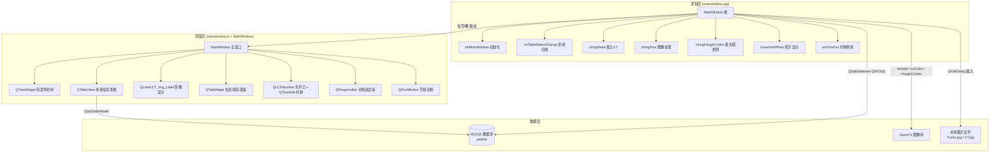
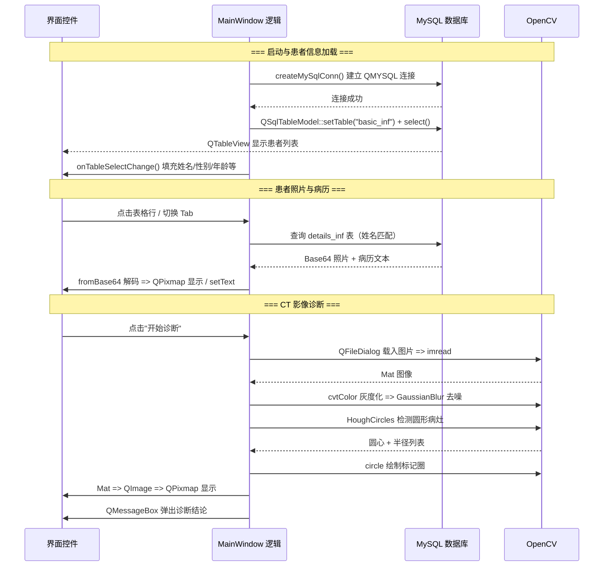
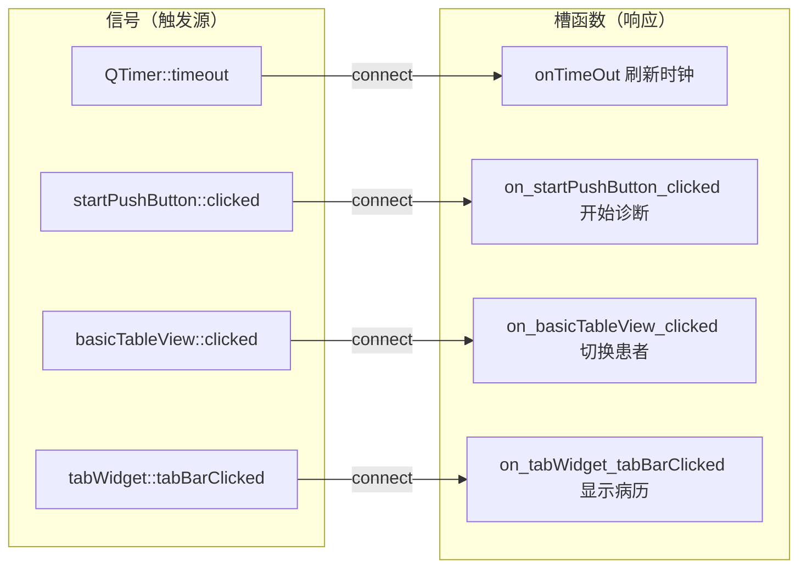
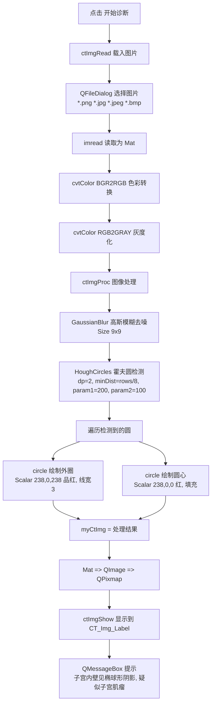

# Telemedicine - 基于 Qt/OpenCV/MySQL 的远程医疗诊断系统

> 江苏省 2018（宁）远程医疗 · 测试版 v1.0 —— 南京市鼓楼医院远程诊断系统

## 项目运行展示

| 信息面板（患者信息 / 病历） | CT 影像诊断（霍夫圆检测） |
|:---:|:---:|
|  |  |

*（占位图：请将实际运行截图重命名为 `show_info.png`、`show_ct.png` 放入项目根目录）*

---

## 目录

- [1. 项目概述](#1-项目概述)
- [2. 系统架构](#2-系统架构)
  - [2.1 整体架构图](#21-整体架构图)
  - [2.2 数据流图](#22-数据流图)
- [3. 项目文件结构](#3-项目文件结构)
- [4. 数据库设计](#4-数据库设计)
  - [4.1 连接配置](#41-连接配置)
  - [4.2 数据表结构](#42-数据表结构)
- [5. 信号与槽 / 事件机制](#5-信号与槽--事件机制)
- [6. 核心流程详解](#6-核心流程详解)
  - [6.1 程序启动与数据库连接流程](#61-程序启动与数据库连接流程)
  - [6.2 患者信息显示流程](#62-患者信息显示流程)
  - [6.3 CT 影像处理流程](#63-ct-影像处理流程)
  - [6.4 患者照片与病历显示流程](#64-患者照片与病历显示流程)
- [7. 关键技术点与 Qt/C++ 知识点](#7-关键技术点与-qtc-知识点)
- [8. 构建与运行](#8-构建与运行)
- [9. 待优化项](#9-待优化项)

---

## 1. 项目概述

Telemedicine 是一个基于 **Qt 5 + OpenCV + MySQL** 实现的远程医疗诊断桌面客户端。系统面向 **"区域医疗中心（南京市鼓楼医院）+ 下属区县医院"** 的远程会诊场景，为医生提供一个统一的工作台：

- **患者信息管理**：从 MySQL 数据库读取患者基本信息（姓名、性别、年龄、民族、医保卡编号、照片）与病历，以表格 + 详情面板的形式展示。
- **CT 影像诊断**：载入患者 CT 图像，通过 OpenCV 图像处理（灰度化、高斯模糊、霍夫圆检测）自动圈出疑似病灶（子宫肌瘤），并生成诊断结论。
- **科室导航**：左侧树形控件展示"区县 → 科室"的医院组织架构。

**核心特性：**

- Qt Model/View 架构（`QSqlTableModel` + `QTableView`）实现数据库表格展示
- OpenCV 霍夫圆检测（`HoughCircles`）自动识别 CT 影像中的椭球形病灶
- `Mat` 与 `QImage` 零拷贝共享内存，实现 OpenCV 处理结果直出 Qt 界面
- 患者照片以 Base64 编码存储于数据库，运行时解码显示
- `QTimer` 定时刷新实时时钟与日期（LCD 数字显示）
- 数据库断连时自动拉起 `mysqld.exe` 并重连

---

## 2. 系统架构

### 2.1 整体架构图



### 2.2 数据流图



---

## 3. 项目文件结构

```
Telemedicine/
├── Telemedicine.pro                 # Qt 项目文件（qmake）
├── README.md                        # 本文档
├── main.cpp                         # 程序入口（~16 行）
├── mainwindow.h                     # 主窗口类声明（~79 行）
├── mainwindow.cpp                   # 主窗口实现（~213 行）
├── mainwindow.ui                    # Qt Designer 界面布局
├── ui_mainwindow.h                  # 由 .ui 自动生成的 UI 头文件
│
├── CT.jpg                           # 界面初始 CT 影像
├── Tumor.jpg                        # 待诊断的肿瘤 CT 影像
├── Tumor_proced.jpg                 # 处理后的 CT 影像（诊断输出）
│
├── packages/                        # 第三方依赖库（随项目分发）
│   ├── opencv4_x64-windows/         # OpenCV 4.x（头文件 + lib）
│   │   ├── include/
│   │   └── lib/                     # opencv_core4 / imgproc4 / imgcodecs4
│   └── mysql_lib/
│       ├── x32/                     # MySQL 连接库（32 位）
│       ├── x64/                     # MySQL 连接库（64 位）
│       └── x64_8.1/                 # MySQL 8.1 连接库（当前使用）
│           ├── include/
│           └── lib/                 # libmysql
│
└── dll/                             # 运行时依赖 DLL
    ├── ALL/                         # OpenCV 全部模块 DLL + 图像编解码 DLL
    ├── opencv/                      # OpenCV 运行时库
    ├── qmysql/                      # Qt MySQL 驱动插件
    ├── jpeg62/ libpng16/ libweb/ liblzma/ tiff/ zlib1/   # 图像编解码依赖
    └── caching_sha2_password.dll    # MySQL 8.0 认证插件（根目录）
```

---

## 4. 数据库设计

### 4.1 连接配置

系统使用 **Qt SQL 模块** 的 `QMYSQL` 驱动连接 MySQL（[mainwindow.h L56-L76](mainwindow.h#L56)）：

```cpp
QSqlDatabase sqldb = QSqlDatabase::addDatabase("QMYSQL");
sqldb.setHostName("127.0.0.1");     // 本机
sqldb.setPort(3306);                // 默认端口
sqldb.setDatabaseName("patient");   // 数据库名
sqldb.setUserName("root");          // 用户名
sqldb.setPassword("123456");        // 密码
```

| 配置项 | 值 | 说明 |
|--------|-----|------|
| 驱动 | `QMYSQL` | Qt 的 MySQL 插件（`qsqlmysql.dll`） |
| 主机 | `127.0.0.1` | 本机回环地址 |
| 端口 | `3306` | MySQL 默认端口 |
| 数据库 | `patient` | 患者数据库 |
| 用户 | `root` | 数据库账号 |
| 密码 | `123456` | 数据库密码 |

### 4.2 数据表结构

系统涉及两张数据表：

**`basic_inf`（患者基本信息表）：**

| 列索引 | 字段含义 | 类型 | 用途 |
|--------|----------|------|------|
| 0 | 医保卡编号（SSN） | varchar | 展示在 `ssnLineEdit` |
| 1 | 姓名 | varchar | 展示在 `nameLabel`，用于关联病历/照片 |
| 2 | 性别 | varchar（"男"/"女"） | 控制 `maleRadioButton`/`femaleRadioButton` |
| 3 | 民族 | varchar | 展示在 `ethniComboBox` |
| 4 | 出生日期 | date | 计算年龄 `ageSpinBox` |

**`details_inf`（患者明细表）：**

| 列索引 | 字段含义 | 类型 | 用途 |
|--------|----------|------|------|
| 0 | 姓名 | varchar | 与 `basic_inf` 关联 |
| 1 | 病历 | text | 展示在 `caseTextEdit` |
| 2 | 照片 | blob（Base64 编码） | 解码后展示在 `photoLabel` |

**关联关系**：两张表通过 **姓名（name）** 字段进行关联（`showUserPhoto` 与 `on_tabWidget_tabBarClicked` 中均按姓名遍历 `details_inf` 匹配当前患者）。

---

## 5. 信号与槽 / 事件机制

不同于原生 Win32 的消息循环，Qt 使用 **信号与槽（Signal & Slot）** 机制实现对象间通信。本项目涉及的信号槽如下：



**关键设计点：**

1. **自动命名槽**：`on_<控件名>_<信号名>()` 命名约定由 `ui` 自动通过 `connectSlotsByName` 连接，无需手动 `connect`。例如 `on_startPushButton_clicked` 自动绑定"开始诊断"按钮的 `clicked()` 信号。

2. **手动连接**：仅 `QTimer::timeout` 通过显式 `connect` 连接（[mainwindow.cpp L46](mainwindow.cpp#L46)）：
   ```cpp
   connect(myTimer, SIGNAL(timeout()), this, SLOT(onTimeOut()));
   ```

3. **元对象系统**：类声明中的 `Q_OBJECT` 宏 + `private slots:` 关键字由 **moc（Meta-Object Compiler）** 预处理，生成信号槽的元数据与派发代码。

---

## 6. 核心流程详解

### 6.1 程序启动与数据库连接流程

```
main()
├── QApplication a(argc, argv)      # 创建应用对象
├── createMySqlConn()               # 首次尝试连接数据库
│   └── QSqlDatabase::addDatabase("QMYSQL")
│       ├── setHostName/Port/Name/User/Password
│       └── sqldb.open()
│           ├── 成功 → 返回 true
│           └── 失败 → QMessageBox 弹窗 + exit(-1)
│
├── 若连接失败：
│   ├── QProcess process            # 创建进程对象
│   ├── process.start(".../mysqld.exe")   # 拉起 MySQL 服务进程
│   └── createMySqlConn() 重试      # 再次连接
│
├── MainWindow w                    # 创建主窗口
├── w.show()                        # 显示窗口
└── a.exec()                        # 进入事件循环
```

### 6.2 患者信息显示流程

```
MainWindow 构造函数
├── setupUi(this)                   # 加载 .ui 界面
├── initMainWindow()                # 初始化影像 + 时钟
├── new QSqlTableModel(model)       # 创建患者表模型
│   ├── setTable("basic_inf")
│   └── select()                    # 执行 SELECT 查询
├── new QSqlTableModel(model_d)     # 创建明细表模型
│   ├── setTable("details_inf")
│   └── select()
├── basicTableView->setModel(model) # 表格绑定模型
└── onTableSelectChange(0)          # 默认选中第一行患者
    ├── index(r,1) → nameLabel      # 姓名
    ├── index(r,2) → 性别单选钮      # "男"/"女"
    ├── index(r,4) → 计算年龄         # 当前年 - 出生年
    ├── index(r,3) → ethniComboBox   # 民族
    ├── index(r,0) → ssnLineEdit     # 医保卡编号
    └── showUserPhoto()             # 显示照片
```

**关键技术细节：**

- **QSqlTableModel**：Qt SQL 提供的表格模型，`setTable()` + `select()` 即可将整张表加载为可编辑/只读模型，通过 `QTableView` 显示。
- **QModelIndex**：`model->index(row, column)` 定位到具体单元格，`model->data(index)` 返回 `QVariant`，再 `toString()`/`toDate()` 转换。
- **年龄计算**：无独立年龄字段，由"当前年份 − 出生年份"动态计算（[mainwindow.cpp L67-L68](mainwindow.cpp#L67)）。

### 6.3 CT 影像处理流程



**霍夫圆检测参数解析**（[mainwindow.cpp L119-L143](mainwindow.cpp#L119)）：

```cpp
HoughCircles(ctGrayImg, h_circles, HOUGH_GRADIENT,
             2,                 // dp：累加器分辨率 = 输入/2（分辨率降低）
             ctGrayImg.rows/8,  // minDist：圆心最小间距 = 图像高/8
             200,               // param1：Canny 边缘检测高阈值
             100);              // param2：累加器阈值（越小检出越多）
```

| 参数 | 值 | 说明 |
|------|-----|------|
| 检测方法 | `HOUGH_GRADIENT` | 基于梯度的霍夫变换 |
| `dp` | 2 | 累加器分辨率与输入图像比值的倒数 |
| `minDist` | `rows/8` | 防止重复检出同一圆的最小圆心距离 |
| `param1` | 200 | Canny 边缘检测的高阈值（低阈值为其一半） |
| `param2` | 100 | 圆心累加器阈值，越小检出的圆越多（含误检） |

### 6.4 患者照片与病历显示流程

```
患者照片（showUserPhoto）
├── 遍历 details_inf 表（model_d）
│   ├── index(i,0) 读取姓名
│   └── 与 nameLabel 文本匹配
│       └── 匹配成功 → 定位到 index(i,2)（照片列）
├── toByteArray() 读取 Base64 数据
├── QByteArray::fromBase64() 解码为二进制
├── QPixmap::loadFromData(data, "JPG")   # 从内存加载图片
└── photoLabel->setPixmap(photo)         # 显示

病历显示（on_tabWidget_tabBarClicked）
├── 切换到"病历"Tab（index == 1）
├── 遍历 details_inf 按姓名匹配
├── 定位到 index(i,1)（病历列）
├── caseTextEdit->setText(病历文本)
└── setFont(QFont("楷体", 12))           # 病历专用字体
```

**关键技术细节：**

- **Base64 存储**：照片以 Base64 字符串存于数据库 `blob` 字段，读取时 `QByteArray::fromBase64()` 解码还原为 JPG 二进制流，再由 `QPixmap::loadFromData()` 直接从内存解码显示，全程无临时文件落盘。

---

## 7. 关键技术点与 Qt/C++ 知识点

### 7.1 Qt 框架基础 — 事件循环与元对象系统

```cpp
// 程序入口
int main(int argc, char *argv[]) {
    QApplication a(argc, argv);   // 初始化 Qt 应用
    MainWindow w;
    w.show();
    return a.exec();              // 进入事件循环（阻塞）
}

// 类声明中的元对象标记
class MainWindow : public QMainWindow {
    Q_OBJECT                       // 启用信号槽、动态属性等
private slots:                     // 槽函数段（moc 识别）
    void onTimeOut();
    void on_startPushButton_clicked();
};
```

| 知识点 | 说明 |
|--------|------|
| **QApplication** | 管理 GUI 应用的控制流与主要设置，`exec()` 进入事件循环 |
| **事件驱动** | 与 Win32 消息循环类似，Qt 通过事件循环分发鼠标/键盘/定时器/重绘事件 |
| **Q_OBJECT 宏** | 声明元对象所需成员，由 moc 生成 `moc_mainwindow.cpp` |
| **moc** | 元对象编译器，qmake 构建时自动运行，生成信号槽元数据 |
| **自动连接** | `connectSlotsByName` 按命名约定自动关联 UI 控件信号与槽 |

### 7.2 MySQL 数据库 — QSqlDatabase 与 QMYSQL 驱动

```cpp
#include <QSqlDatabase>
#include <QSqlError>

QSqlDatabase sqldb = QSqlDatabase::addDatabase("QMYSQL");  // 加载 MySQL 驱动
sqldb.setHostName("127.0.0.1");
sqldb.setPort(3306);
sqldb.setDatabaseName("patient");
sqldb.setUserName("root");
sqldb.setPassword("123456");

if (!sqldb.open()) {
    qDebug() << sqldb.lastError();       // 输出错误详情
    return false;
}
```

| 知识点 | 说明 |
|--------|------|
| **QSqlDatabase** | Qt SQL 的数据库连接抽象，`addDatabase()` 注册一个命名连接 |
| **QMYSQL 驱动** | Qt 的 MySQL 插件，运行时需 `qsqlmysql.dll`（项目内置于 `dll/qmysql/`） |
| **lastError()** | 返回 `QSqlError`，包含错误码与描述，用于诊断连接失败原因 |
| **MySQL 8.0 认证** | 需 `caching_sha2_password.dll` 支持默认的 `caching_sha2_password` 认证插件 |

### 7.3 Qt Model/View 架构 — QSqlTableModel

```cpp
QSqlTableModel *model = new QSqlTableModel(this);
model->setTable("basic_inf");    // 绑定数据表
model->select();                  // 执行 SELECT，填充模型
ui->basicTableView->setModel(model);  // 视图绑定模型

// 读取单元格
QModelIndex index = model->index(row, column);
QString name = model->data(index).toString();
```

| 知识点 | 说明 |
|--------|------|
| **Model/View 分离** | 模型（数据）与视图（显示）解耦，一个模型可绑定多个视图 |
| **QSqlTableModel** | 针对单表的只读/可编辑模型，自动生成 SQL 查询 |
| **QModelIndex** | 模型的索引对象，`(row, column)` 定位单元格 |
| **QVariant** | `data()` 返回 `QVariant`，可隐式/显式转为 `QString`/`QDate`/`int` 等 |

### 7.4 OpenCV 图像处理 — 灰度化、模糊、霍夫圆检测

```cpp
#include "opencv2/opencv.hpp"
using namespace cv;

Mat ctImg = imread("Tumor.jpg");                 // 读取图像
Mat ctRgbImg, ctGrayImg;
cvtColor(ctImg, ctRgbImg, COLOR_BGR2RGB);        // BGR → RGB
cvtColor(ctRgbImg, ctGrayImg, COLOR_RGB2GRAY);   // RGB → 灰度

GaussianBlur(ctGrayImg, ctGrayImg, Size(9,9), 2, 2);   // 高斯滤波去噪

vector<Vec3f> h_circles;
HoughCircles(ctGrayImg, h_circles, HOUGH_GRADIENT,
             2, ctGrayImg.rows/8, 200, 100);

for (size_t i = 0; i < h_circles.size(); i++) {
    Point center(cvRound(h_circles[i][0]), cvRound(h_circles[i][1]));
    int radius = cvRound(h_circles[i][2]);
    circle(ctColorImg, center, radius, Scalar(238,0,238), 3);  // 外圈
    circle(ctColorImg, center, 3, Scalar(238,0,0), -1);        // 圆心
}
```

| 知识点 | 说明 |
|--------|------|
| **Mat** | OpenCV 核心矩阵类，管理图像像素与内存 |
| **cvtColor** | 颜色空间转换，`COLOR_BGR2RGB`/`COLOR_RGB2GRAY` 等 |
| **GaussianBlur** | 高斯模糊，`Size(9,9)` 卷积核尺寸，`2,2` 为 x/y 方向标准差 |
| **HoughCircles** | 霍夫圆检测，返回 `vector<Vec3f>`（每个元素 = 圆心 x、y、半径） |
| **circle** | 绘制圆形，`-1` 线宽表示实心填充 |

### 7.5 Mat 与 QImage/QPixmap 互转 — 零拷贝共享内存

```cpp
// Mat → QImage（共享底层数据，不复制像素）
Mat ctRgbImg;                         // 已经是 RGB 三通道
QImage qimg((const unsigned char*)ctRgbImg.data,   // 数据指针
            ctRgbImg.cols, ctRgbImg.rows,          // 宽、高
            QImage::Format_RGB888);                // 格式

// QImage → QPixmap → QLabel 显示
ui->CT_Img_Label->setPixmap(
    QPixmap::fromImage(qimg).scaled(
        ui->CT_Img_Label->size(), Qt::KeepAspectRatio));  // 等比缩放
```

| 知识点 | 说明 |
|--------|------|
| **共享数据指针** | `QImage` 直接引用 `Mat.data`，不复制像素，节省内存 |
| **Format_RGB888** | 每像素 3 字节（R、G、B 各 1 字节），与 OpenCV 三通道 `CV_8UC3` 布局一致 |
| **BGR → RGB 必要性** | OpenCV 默认 BGR 顺序，Qt 需 RGB，故必须先 `cvtColor` |
| **QPixmap vs QImage** | `QImage` 独立于硬件，`QPixmap` 面向屏幕显示，GUI 用后者 |
| **scaled + KeepAspectRatio** | 等比缩放，保持图像宽高比不变形 |

### 7.6 定时器与时钟 — QTimer

```cpp
QTimer *myTimer = new QTimer();
myTimer->setInterval(1000);      // 每 1000ms 触发一次
myTimer->start();
connect(myTimer, SIGNAL(timeout()), this, SLOT(onTimeOut()));

void MainWindow::onTimeOut() {
    ui->timeEdit->setTime(QTime::currentTime());  // 更新当前时间
}
```

| 知识点 | 说明 |
|--------|------|
| **QTimer** | 定时器类，`setInterval()` 设置周期，`start()` 启动 |
| **timeout 信号** | 每次到点发出，驱动槽函数执行 |
| **QLCDNumber** | LCD 数码管风格显示，`display()` 设置数字，`digitCount()` 设置位数 |

### 7.7 Base64 图像存储与读取

```cpp
// 从数据库读取 Base64 照片并显示
QByteArray base64ImageData = model_d->data(index).toByteArray();
QByteArray imageData = QByteArray::fromBase64(base64ImageData);  // 解码
QPixmap photo;
photo.loadFromData(imageData, "JPG");                            // 内存加载
ui->photoLabel->setPixmap(photo);
```

| 知识点 | 说明 |
|--------|------|
| **Base64** | 二进制 → 可打印 ASCII 编码，便于存入数据库文本/blob 字段 |
| **fromBase64()** | `QByteArray` 静态方法，将 Base64 解码为原始二进制 |
| **loadFromData()** | `QPixmap` 直接从内存字节数组解码图片，无需文件 |

### 7.8 内存图像保存 — QBuffer 与 QByteArray

```cpp
void MainWindow::ctImgSave() {
    QFile image("Tumor_proced.jpg");        // 打开输出文件
    image.open(QIODevice::ReadWrite);
    QByteArray qba;
    QBuffer buf(&qba);                      // 内存缓冲区
    buf.open(QIODevice::WriteOnly);
    myCtQImage.save(&buf, "JPG");           // 写入内存（编码为 JPG）
    image.write(qba);                       // 一次性写入磁盘
}
```

| 知识点 | 说明 |
|--------|------|
| **QBuffer** | `QIODevice` 的内存实现，提供"内存即文件"的流接口 |
| **QImage::save(&buf, "JPG")** | 将图像编码为指定格式写入 `QIODevice` |
| **无中间临时文件** | 图像先在内存编码，再一次落盘 |

### 7.9 文件对话框 — QFileDialog

```cpp
QString ctImgName = QFileDialog::getOpenFileName(
    this,                                            // 父窗口
    u8"载入CT相片",                                    // 标题
    ".",                                             // 起始目录
    "Image File(*.png *.jpg *.jpeg *.bmp)");         // 过滤格式
if (ctImgName.isEmpty()) return;                     // 用户取消
Mat ctImg = imread(ctImgName.toLatin1().data());     // OpenCV 读取
```

| 知识点 | 说明 |
|--------|------|
| **getOpenFileName** | 静态方法，弹出文件选择对话框，返回选中路径（取消则返回空串） |
| **文件过滤器** | 限定可选文件类型，格式为 `"描述(*.ext1 *.ext2)"` |
| **toLatin1().data()** | `QString` → `const char*`，供 OpenCV `imread` 使用 |

### 7.10 进度条与事件处理 — QProgressBar 与 processEvents

```cpp
void MainWindow::on_startPushButton_clicked() {
    ctImgRead();                 // 1. 载入图片
    ui->progressBar->setMaximum(0);   // 0 = 忙碌指示（来回滚动）
    // 模拟耗时操作，同时保持界面响应
    QTime time; time.start();
    while (time.elapsed() < 5000)
        QCoreApplication::processEvents();   // 处理未决事件，避免界面假死
    ui->progressBar->setMaximum(100);
    ctImgProc();                 // 2. 图像处理
    ctImgSave();                 // 3. 保存结果
}
```

| 知识点 | 说明 |
|--------|------|
| **QProgressBar** | 进度条控件，`setMaximum(0)` 显示忙碌动画，`setValue()` 设置进度 |
| **processEvents()** | 在处理长任务期间临时处理事件队列，防止 UI 无响应 |
| **QTime::elapsed()** | 返回自 `start()` 起的毫秒数，用于模拟/测量耗时 |

### 7.11 QProcess — 启动外部进程

```cpp
#include <QProcess>
QProcess process;
process.start("C:/Program Files/MySQL/MySQL Server 8.0/bin/mysqld.exe");
```

| 知识点 | 说明 |
|--------|------|
| **QProcess** | 在 Qt 应用中启动外部程序并与其交互 |
| **start()** | 异步启动进程，`waitForStarted()/waitForFinished()` 可同步等待 |

---

## 8. 构建与运行

### 8.1 环境要求

| 组件 | 要求 |
|------|------|
| 操作系统 | Windows 10/11 x64 |
| IDE | Qt Creator（或任意支持 qmake 的环境） |
| Qt 版本 | Qt 5.x（含 `widgets`、`sql` 模块） |
| 编译器 | MSVC x64（或 MinGW x64，需匹配 OpenCV 预编译库） |
| OpenCV | 4.x（项目内置 `packages/opencv4_x64-windows/`） |
| MySQL | 8.x（数据库 `patient` 需预先创建） |
| 数据库 | 需安装 MySQL 并导入 `patient` 库及 `basic_inf`/`details_inf` 表 |

### 8.2 依赖配置（Telemedicine.pro）

项目通过 qmake 的 `INCLUDEPATH` 与 `LIBS` 引用随项目分发的第三方库（[Telemedicine.pro L62-L65](Telemedicine.pro#L62)）：

```pro
# OpenCV（$$PWD = 项目根目录）
INCLUDEPATH += $$PWD/packages/opencv4_x64-windows/include
LIBS += -L$$PWD/packages/opencv4_x64-windows/lib \
        -lopencv_core4 -lopencv_imgproc4 -lopencv_imgcodecs4

# MySQL
LIBS += -L$$PWD/packages/mysql_lib/x64_8.1/lib -llibmysql
INCLUDEPATH += $$PWD/packages/mysql_lib/x64_8.1/include
```

### 8.3 构建步骤

1. **打开项目**：用 Qt Creator 打开 `Telemedicine.pro`。
2. **选择套件**：选择 x64 的 MSVC 套件（与 OpenCV/MySQL 库位数一致）。
3. **构建**：`构建 → 构建项目 (Ctrl+B)`。
4. **准备数据库**：确保本机 MySQL 服务已启动，并存在 `patient` 库及两张表。

### 8.4 运行步骤

1. **确保运行时依赖**：将 `dll/` 下的运行时库与 `qsqlmysql` 驱动插件放到可执行文件同目录（或系统 PATH）。
2. **启动程序**：运行编译产物（或 Qt Creator 中 `Ctrl+R`）。
   - 若数据库未启动，程序会尝试通过 `QProcess` 自动拉起 `mysqld.exe` 并重连。
3. **使用流程**：
   - 左侧树形控件选择科室，下方表格浏览患者列表。
   - 点击表格行，右侧信息面板联动显示患者详情（含照片）。
   - 点击"开始诊断"，选择 CT 影像文件，系统自动检测病灶并弹出诊断结论。

### 8.5 配置说明

- **数据库连接**：主机/端口/库名/账号密码硬编码于 `mainwindow.h` 的 `createMySqlConn()`，按需修改。
- **MySQL 服务路径**：`main.cpp` 中 `mysqld.exe` 路径硬编码为 `C:/Program Files/MySQL/MySQL Server 8.0/bin/mysqld.exe`，按实际安装路径修改。
- **初始影像**：程序启动时默认加载根目录 `Tumor.jpg`（[mainwindow.cpp L29](mainwindow.cpp#L29)）。

---

## 9. 待优化项

| 优先级 | 项目 | 说明 |
|--------|------|------|
| 高 | 数据库安全 | 账号密码明文硬编码，应改为配置文件或环境变量 |
| 高 | 索引越界风险 | `onTableSelectChange` 按固定列索引取值，表结构变化即崩溃，应改为按字段名查询 |
| 高 | 姓名关联 | 用姓名关联两张表，重名患者会导致数据错乱，应使用主键/医保卡编号关联 |
| 高 | SQL 注入 | 当前用 `QSqlTableModel` 无显式拼接，但若扩展手写 SQL 需使用参数绑定 |
| 中 | 空表处理 | 数据库无数据时 `model->index()` 无效，`onTableSelectChange(0)` 可能崩溃 |
| 中 | 硬编码路径 | 图片路径、`mysqld.exe` 路径均硬编码，缺乏可移植性 |
| 中 | 诊断逻辑 | 霍夫圆检测参数固定，对不同 CT 影像适应性差，结论为固定文案而非真实医学判断 |
| 中 | 假耗时 | 用 `processEvents()` + 空循环模拟进度，应替换为真实处理进度或后台线程 |
| 低 | 多线程 | 图像处理在主线程执行，大图会卡顿 UI，应移至 `QThread`/`QtConcurrent` |
| 低 | 配置文件 | 无 ini/json 配置，所有参数硬编码 |
| 低 | 界面自适应 | 控件使用绝对坐标（`geometry`），高 DPI / 拉伸窗口时布局错乱 |
| 低 | 字体依赖 | 使用"华文楷体/华文仿宋"等字体，目标机器缺字体时显示异常 |

---

## 知识索引

本项目涉及的 **Qt / C++ / OpenCV / MySQL** 核心知识点速查：

```
┌─ Qt 框架基础
│  ├─ QApplication / QMainWindow
│  ├─ 事件循环 (a.exec / processEvents)
│  ├─ 元对象系统 (Q_OBJECT / moc / signals / slots)
│  ├─ connectSlotsByName 自动连接
│  └─ 容器 QString / QByteArray / QVariant
├─ Qt GUI 控件
│  ├─ QLabel (setPixmap / setText / scaledContents)
│  ├─ QTableView / QTreeWidget / QTabWidget
│  ├─ QRadioButton / QComboBox / QSpinBox / QLineEdit
│  ├─ QProgressBar / QLCDNumber / QTimeEdit
│  └─ QPushButton (clicked 信号)
├─ Qt SQL
│  ├─ QSqlDatabase (addDatabase / open / lastError)
│  ├─ QMYSQL 驱动 (qsqlmysql.dll)
│  ├─ QSqlTableModel (setTable / select)
│  └─ QModelIndex (index / data)
├─ Qt 文件与流
│  ├─ QFileDialog (getOpenFileName)
│  ├─ QFile / QBuffer / QIODevice
│  └─ QByteArray::fromBase64
├─ Qt 图像
│  ├─ QImage (Format_RGB888 / save)
│  ├─ QPixmap (fromImage / loadFromData / scaled)
│  └─ Mat ⇄ QImage 共享数据指针
├─ OpenCV
│  ├─ Mat / imread / imwrite
│  ├─ cvtColor (BGR2RGB / RGB2GRAY)
│  ├─ GaussianBlur 高斯模糊
│  ├─ HoughCircles 霍夫圆检测
│  ├─ circle 绘制
│  └─ Scalar / Point / Vec3f
├─ 进程与定时
│  ├─ QProcess (start)
│  ├─ QTimer (setInterval / start / timeout)
│  └─ QTime (currentTime / elapsed)
└─ 预处理器 / 构建
   ├─ qmake (QT += / SOURCES / HEADERS / FORMS)
   ├─ INCLUDEPATH / LIBS 第三方库链接
   └─ $$PWD 项目根目录宏
```
