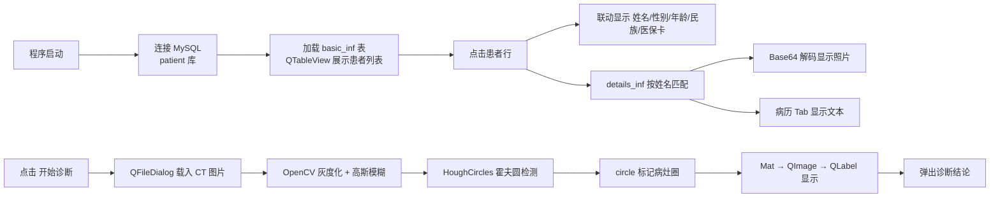

# Telemedicine（构建/部署版）— 基于 Qt/OpenCV/MySQL 的远程医疗诊断系统
## 目录

- [1. 目录说明](#1-目录说明)
- [2. 项目文件结构](#2-项目文件结构)
- [3. 构建流程](#3-构建流程)
- [4. 部署包说明](#4-部署包说明)
  - [4.1 运行时依赖清单](#41-运行时依赖清单)
  - [4.2 Qt 插件](#42-qt-插件)
- [5. 运行步骤](#5-运行步骤)
- [6. 数据库设计](#6-数据库设计)
- [7. 核心功能概览](#7-核心功能概览)
- [8. 关键技术点](#8-关键技术点)
- [9. 待优化项](#9-待优化项)

---

## 1. 目录说明

| 目录 / 文件 | 性质 | 说明 |
|-------------|------|------|
| `main.cpp` 等源码 | 源文件 | 与主项目（`D:\面试项目\Telemedicine\Telemedicine`）完全一致 |
| `Telemedicine.pro` | 项目文件 | qmake 工程描述 |
| `Makefile*` | 构建文件 | 由 `qmake` 生成，勿手工修改 |
| `release/` | 构建产物 | Release 编译中间产物（`.obj`、`moc_*.cpp`）与 `Telemedicine.exe` |
| `debug/` | 构建产物 | Debug 构建输出（当前为空） |
| `deploy/` | **部署包** | 可独立运行的分发目录（exe + 全部运行时依赖 + 插件 + 图片） |
| `packages/` | 第三方库 | OpenCV 4.x 与 MySQL 连接库（供编译期链接） |
| `app.log` | 日志 | 运行时日志文件（当前为空） |

> **与主项目的区别**：本目录的 `packages/mysql_lib` 仅保留编译期所需的 `include/` 与 `lib/`（约 7.4 MB），
> 不含完整 MySQL 服务器（`mysqld.exe`）；主项目则保留了完整 MySQL 发行包（约 579 MB）。

---

## 2. 项目文件结构

```
tele_build/
├── README.md                        # 本文档
├── main.cpp                         # 程序入口（~16 行）
├── mainwindow.h                     # 主窗口类声明（~79 行）
├── mainwindow.cpp                   # 主窗口实现（~213 行）
├── mainwindow.ui                    # Qt Designer 界面布局
├── ui_mainwindow.h                  # 由 .ui 生成的 UI 头文件
├── Telemedicine.pro                 # qmake 项目文件
├── threadpool.h                     # 自研线程池（std::thread + 条件变量）
├── threadpool.cpp                   # 线程池实现（后台执行图像处理）
│
├── Makefile                         # qmake 生成（Debug/Release 共用入口）
├── Makefile.Debug                   # Debug 构建规则
├── Makefile.Release                 # Release 构建规则
├── .qmake.stash                     # qmake 配置缓存
├── app.log                          # 运行时日志（空）
│
├── debug/                           # Debug 构建输出目录（当前为空）
│
├── release/                         # Release 构建输出
│   ├── Telemedicine.exe             # 编译产物
│   ├── main.obj / mainwindow.obj    # 目标文件
│   ├── moc_mainwindow.cpp/.obj      # moc 生成的元对象代码
│   └── moc_predefs.h                # moc 预处理头
│
├── deploy/                          # ★ 可运行部署包（自包含）
│   ├── Telemedicine.exe             # 主程序
│   ├── Qt5Core.dll / Qt5Gui.dll     # Qt 核心库
│   ├── Qt5Sql.dll / Qt5Widgets.dll  # Qt SQL / 控件库
│   ├── libmysql.dll                 # MySQL 客户端库
│   ├── caching_sha2_password.dll    # MySQL 8.0 认证插件
│   ├── opencv_*.dll                 # OpenCV 运行时（全套模块）
│   ├── jpeg62/tiff/libpng16/...     # 图像编解码依赖
│   ├── libcrypto / libssl           # OpenSSL 依赖
│   ├── sqldrivers/                  # Qt SQL 驱动插件
│   │   └── qsqlmysql.dll            #   MySQL 驱动
│   ├── platforms/                   # Qt 平台插件
│   │   └── qwindows.dll             #   Windows 平台支持
│   ├── imageformats/                # Qt 图像格式插件
│   │   └── qgif/qico/qjpeg(.d).dll  #   GIF/ICO/JPEG 解码
│   ├── CT.jpg                       # 初始 CT 影像
│   ├── Tumor.jpg                    # 待诊断肿瘤 CT 影像
│   └── Tumor_proced.jpg             # 诊断输出影像
│
└── packages/                        # 第三方编译期依赖
    ├── opencv4_x64-windows/         # OpenCV 4.x（bin/lib/include/share）
    │   ├── bin/                     # 运行时 DLL
    │   ├── lib/                     # 链接库（opencv_core4/imgproc4/imgcodecs4）
    │   └── include/opencv2/         # 头文件
    └── mysql_lib/
        └── x64_8.1/                 # MySQL 8.1 连接库
            ├── include/             # mysql.h / openssl 头文件
            └── lib/                 # libmysql.lib
```

---

## 3. 构建流程

### 3.1 依赖配置（Telemedicine.pro）

```pro
QT += core gui sql            # 使用 Core / GUI / SQL 模块
TARGET = Telemedicine
TEMPLATE = app
CONFIG += c++11

# 第三方库（$$PWD = 项目根目录）
INCLUDEPATH += $$PWD/packages/opencv4_x64-windows/include
LIBS += -L$$PWD/packages/opencv4_x64-windows/lib \
        -lopencv_core4 -lopencv_imgproc4 -lopencv_imgcodecs4

LIBS += -L$$PWD/packages/mysql_lib/x64_8.1/lib -llibmysql
INCLUDEPATH += $$PWD/packages/mysql_lib/x64_8.1/include
```

### 3.2 构建步骤

1. **生成 Makefile**（如 `Makefile` 已存在可跳过）：
   ```bash
   qmake Telemedicine.pro
   ```
2. **编译 Release 版**：
   ```bash
   make -f Makefile.Release    # 或使用 nmake / mingw32-make，取决于编译器套件
   ```
   产物输出到 `release/Telemedicine.exe`。
3. **编译 Debug 版**（可选）：
   ```bash
   make -f Makefile.Debug      # 产物输出到 debug/
   ```

> 也可直接用 Qt Creator 打开 `Telemedicine.pro`，选择 x64 套件后 `构建 → 构建项目`。

---

## 4. 部署包说明

`deploy/` 目录是一个 **自包含的可运行分发包**：将编译产物 `Telemedicine.exe` 与其全部运行时依赖、
Qt 插件、影像资源集中放置，拷贝到任意 Windows x64 机器上即可直接运行，无需安装 Qt 或 OpenCV。

### 4.1 运行时依赖清单

| 类别 | 文件 | 作用 |
|------|------|------|
| Qt 核心 | `Qt5Core.dll`、`Qt5Gui.dll`、`Qt5Widgets.dll` | Qt 基础库 |
| Qt SQL | `Qt5Sql.dll` | 数据库抽象层 |
| MySQL | `libmysql.dll` | MySQL 客户端库 |
| MySQL 认证 | `caching_sha2_password.dll` | MySQL 8.0 `caching_sha2_password` 认证插件 |
| OpenCV | `opencv_core4/imgproc4/imgcodecs4/highgui4/*.dll` | 图像处理运行时（全套模块） |
| 图像编解码 | `jpeg62.dll`、`libpng16.dll`、`tiff.dll`、`libwebp*.dll`、`liblzma.dll`、`zlib1.dll`、`turbojpeg.dll` | OpenCV 图像读写底层依赖 |
| 加密 | `libcrypto-1_1-x64.dll`、`libssl-1_1-x64.dll` | OpenSSL（MySQL 连接加密所需） |

### 4.2 Qt 插件

| 目录 | 文件 | 作用 |
|------|------|------|
| `platforms/` | `qwindows.dll` | Windows 平台插件（**缺失则程序无法启动**） |
| `sqldrivers/` | `qsqlmysql.dll` | QMYSQL 数据库驱动 |
| `imageformats/` | `qjpeg.dll`、`qgif.dll`、`qico.dll` 等 | QImage/QPixmap 图片格式解码 |

---

## 5. 运行步骤

1. **准备数据库**：确保目标机器已安装 MySQL 8.x，并存在 `patient` 库及 `basic_inf`、`details_inf` 两张表。
2. **启动程序**：双击 `deploy/Telemedicine.exe`（或运行 `release/Telemedicine.exe`，但需自行补齐依赖 DLL）。
   - 若数据库未启动，程序会尝试通过 `QProcess` 拉起 `mysqld.exe` 并重连（路径见下文配置说明）。
3. **使用流程**：
   - 左侧树形控件选择科室，下方表格浏览患者列表。
   - 点击表格行，右侧信息面板联动显示患者详情（含照片、病历）。
   - 点击「开始诊断」，选择 CT 影像文件，系统自动进行霍夫圆检测并弹出诊断结论。

### 配置说明

- **数据库连接**：主机 `127.0.0.1:3306`、库 `patient`、账号 `root`、密码 `123456`，硬编码于 `mainwindow.h` 的 `createMySqlConn()`。
- **MySQL 服务路径**：`main.cpp` 中硬编码为 `C:/Program Files/MySQL/MySQL Server 8.0/bin/mysqld.exe`，按实际安装路径修改。
- **初始影像**：程序启动时默认加载 `deploy/Tumor.jpg`（[mainwindow.cpp L29](mainwindow.cpp#L29)）。

---

## 6. 数据库设计

系统使用 Qt SQL 模块的 `QMYSQL` 驱动连接 MySQL 数据库 `patient`，涉及两张表：

**`basic_inf`（患者基本信息表）：**

| 列索引 | 字段含义 | 展示控件 |
|--------|----------|----------|
| 0 | 医保卡编号 | `ssnLineEdit` |
| 1 | 姓名 | `nameLabel`（关联病历/照片） |
| 2 | 性别（"男"/"女"） | `maleRadioButton`/`femaleRadioButton` |
| 3 | 民族 | `ethniComboBox` |
| 4 | 出生日期 | 计算年龄 → `ageSpinBox` |

**`details_inf`（患者明细表）：**

| 列索引 | 字段含义 | 展示控件 |
|--------|----------|----------|
| 0 | 姓名 | 与 `basic_inf` 关联 |
| 1 | 病历 | `caseTextEdit` |
| 2 | 照片（Base64 编码） | 解码后 → `photoLabel` |

> 两张表通过 **姓名** 字段关联（非主键，重名会错乱，见「待优化项」）。

---

## 7. 核心功能概览



---

## 8. 关键技术点

| 技术点 | 实现 | 说明 |
|--------|------|------|
| **数据库访问** | `QSqlDatabase` + `QMYSQL` | Qt SQL 抽象层，运行时需 `qsqlmysql.dll` 插件 |
| **表格展示** | `QSqlTableModel` + `QTableView` | Model/View 架构，`setTable()` + `select()` 自动查询 |
| **影像载入** | `cv::imread` + `cvtColor` | OpenCV 默认 BGR，需转 RGB 供 Qt 显示 |
| **病灶检测** | `HoughCircles` | 霍夫圆检测，`dp=2, minDist=rows/8, param1=200, param2=100` |
| **图像直出** | `Mat.data` ⇄ `QImage` | 共享底层数据指针，零拷贝 |
| **多线程处理** | 自研 `ThreadPool` + 跨线程信号 | 图像处理移入后台线程池，queued 信号回传，UI 不卡 |
| **照片存储** | Base64 → `QByteArray::fromBase64` | 二进制照片以 Base64 存库，运行时解码 |
| **实时时钟** | `QTimer` + `QLCDNumber` | 1000ms 定时刷新年月日与时间 |
| **数据库自启** | `QProcess::start("mysqld.exe")` | 连接失败时自动拉起 MySQL 服务并重连 |
| **部署打包** | 手工收集 DLL + 插件 | `deploy/` 目录实现自包含分发 |

### 8.1 多线程图像处理（自研线程池）

CT 影像处理（灰度化、高斯模糊、霍夫圆检测）是 CPU 密集操作，原实现放在主线程并用
`processEvents()` 空转模拟进度，会导致界面卡顿。现已重构为 **自研线程池 + 跨线程信号**：

```cpp
// threadpool.cpp 核心：生产者-消费者，condition_variable 同步
void ThreadPool::workerLoop() {
    for (;;) {
        std::function<void()> task;
        {
            std::unique_lock<std::mutex> lock(m_mutex);
            m_cv.wait(lock, [this]{ return m_stop.load() || !m_tasks.empty(); });
            if (m_tasks.empty()) return;   // 停止且队列空 -> 退出
            task = std::move(m_tasks.front());
            m_tasks.pop();
        }
        try { task(); } catch (...) {}     // 异常不能杀死 worker 线程
    }
}

// 主线程投递任务，结果通过 queued 信号回传（Qt 规定 UI 只能主线程操作）
m_pool->enqueue([this, path]() {
    QImage result = processCtImage(path, [this](int v){ emit ctProgressChanged(v); });
    emit ctProcessFinished(result);        // worker 线程 -> 主线程
});
```

| 技术点 | 说明 |
|--------|------|
| 自研 `ThreadPool` | `std::thread` + `std::mutex` + `std::condition_variable` + `std::atomic<bool>` |
| 任务同步 | 条件变量谓词 `m_stop || !m_tasks.empty()` 防止虚假唤醒与丢失唤醒 |
| 异常安全 | 任务异常被捕获，worker 线程不会因此终止 |
| 跨线程 UI 更新 | queued connection 把进度/结果投递回主线程 |
| 生命周期 | `QImage` 跨线程回传前必须 `.copy()` 深拷贝，避免局部 `Mat` 释放后悬垂 |
| 优雅关闭 | `shutdown()` 置停止标志 + `join()`，等待剩余任务执行完 |

---

## 9. 待优化项

| 优先级 | 项目 | 说明 |
|--------|------|------|
| 高 | 数据库安全 | 账号密码明文硬编码，应改用配置文件 |
| 高 | 表关联方式 | 用姓名关联两张表，重名会错乱，应使用主键/医保卡编号 |
| 高 | 列索引硬编码 | 按固定列索引取值，表结构变化即崩溃 |
| 高 | 空表容错 | 数据库无数据时 `onTableSelectChange(0)` 可能越界崩溃 |
| 中 | 硬编码路径 | 图片路径、`mysqld.exe` 路径缺乏可移植性 |
| 中 | 诊断逻辑 | 霍夫圆参数固定、结论为固定文案，非真实医学判断 |
| ~~中~~ | ~~假耗时~~ | ✅ 已解决：移除 `processEvents()` 空循环，进度条反映真实处理阶段 |
| ~~低~~ | ~~图像处理线程~~ | ✅ 已解决：自研 `ThreadPool` 后台处理 + queued 信号回传 UI |
| 低 | 部署自动化 | 依赖 DLL 手工收集易遗漏，建议用 `windeployqt` 自动打包 |
| 低 | 界面自适应 | 控件使用绝对坐标，高 DPI / 拉伸窗口时布局错乱 |
